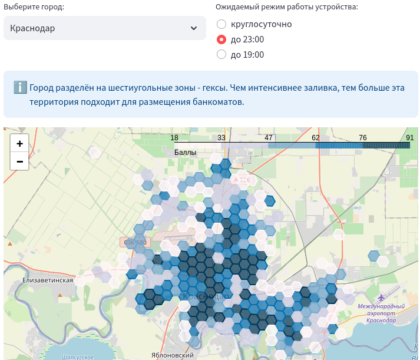

# :bank: Bankamatika
Оценка территории города для оптимального размещения банкоматов.

## Описание
Территория оценивается на основе данных [OpenStreetMap](https://www.openstreetmap.org) по ряду критериев: наличие привлекательных объектов для размещения устройств (торгово-развлекательные центры, продуктовые супермаркеты); количество людей, живущих в шаговой доступности; наличие мест повышенного интереса людей (рынки, магазины, кафе, остановки транспорта и пр.)

## Использование
Перейти на страницу приложения можно по ссылке: [Bankamatika UI]()  
Для начала работы выбираем город и время работы устройства. Территория города разделяется на небольшие шестиугольники - гексы. Каждый гекс получает оценку по 100-бальной шкале: чем выше оценка, тем больше ожидается поток клиентов и тем лучше область подходит для установки банкоматов.

     

